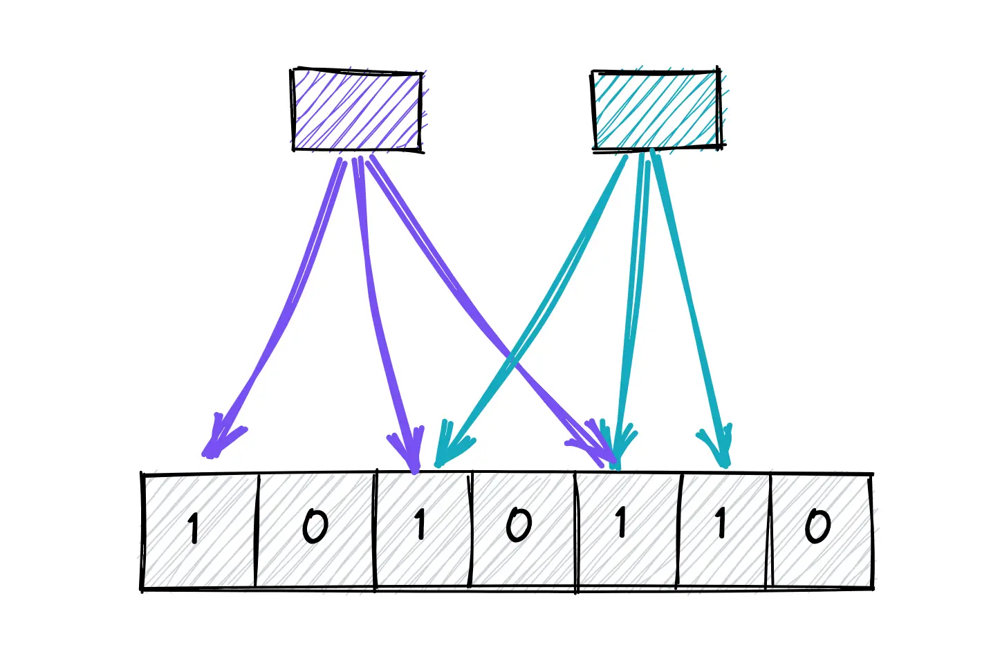

One of the most clever space saving data structures and back end systems is the **Bloom Filter.**

Here's the problem: you need to check if something exists in a huge data set. Think billions of records. But loading all that into memory? Too big.

Hitting the database every time? Way too slow.

That's where **Bloom Filters** come in. It's a probabilistic data structure that tells you maybe it's there or definitely not, and it does so in constant time - just a few hash hops.

Here's how it works:
1) You run the item through a few different hash functions. Each function maps to a bit in a fixed size array.
2) You flip those bits to 1.
3) Next time you want to check if you've seen it before, you just hash it again.
4) If any of the bits are 0, you know for sure it's new, but if they're all one, it might be in the set.

That's the trade off - no false negatives, but some false positives. And that's okay, because "maybe" means you might hit the database, but "definitely not" means you save the round trip entirely.

The upside? A **Bloom Filter** for millions of entries might only use a *single megabyte*. No resizes, no rehashes, just blazing fast memory light checks.

That's why they power things like caches skipping lookups for missing keys, databases avoiding cold disk reads, & CDNs filtering duplicate requests.

So if you're building something where fast existence checks matter, a bloom filter might be the perfect fit. And it's just one `pip`/`npm` install away.
