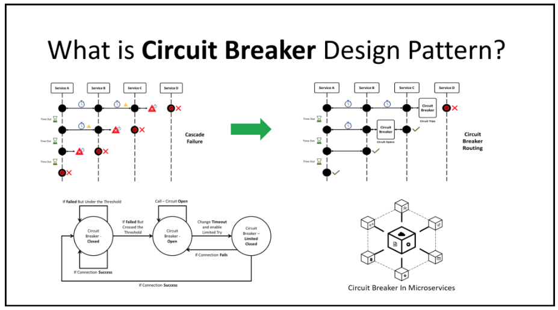

One of the most helpful patterns I've used in back end systems is the circuit breaker.

Circuit Breakers are a resilience pattern - they stop your app from calling something that's already failing, like a third party API or an internal service.

Here's how they work:
- Wrap your call and a circuit breaker.
- If errors spike, say 5 out of 10 requests, it trips and blocks future calls for a while.
- During that time, instead of spamming the broken system, it fails faster & returns a fallback.
- After a timeout, the breaker goes into a half open state. This lets a few requests through to test the waters. If they succeed, the breaker closes, but if not it trips again.
This helps prevent cascading failures, reduces pressure on fragile services, and gives them time to recover.

If you've ever seen a system thrashing because retries kept hammering broken API, that's what circuit Breakers are designed to stop.

Look up a circuit breaker library in your language and start using them!

[Follow me](https://www.linkedin.com/in/john-pratt787/) for more dev tips.
