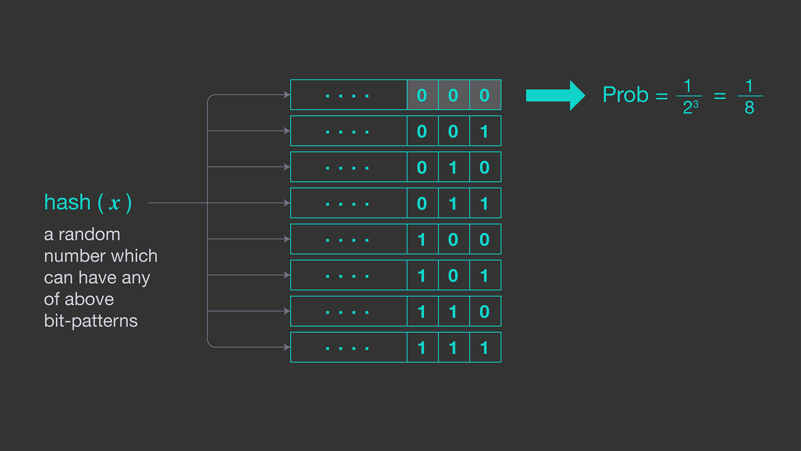

One of the coolest data structures in back end systems is the Bloom filter's
cousin, the **HyperLogLog**.

Here's the problem: you need to run a distinct count over millions of rows, but that takes time,
CPU, and memory.

That's where HyperLogLog comes in.

It's a probabilistic data structure that estimates the number of unique elements in a stream fast and with almost no memory.

Here's how it works:

- Every input is passed through a good hash function like murmur hash or XX hash, which spreads values uniformly across a massive binary space.
- Next, HyperLogLog uses the first P bits of the hash to pick a bucket, then counts the number of leading zeros in the remaining bits.
- The idea is simple - the more distinct values you've seen, the more likely you are to get a hash with a lot of leading zeros. So if you see something like this, that's rare and strong evidence that you've seen a lot of unique items.
- Each bucket tracks the maximum number of leading zeros it has seen, and once all the elements are processed, HyperLogLog combines the Max zero run values using a special harmonic mean formula to estimate the total cardinality.
- The result is a high confidence estimate for the number of unique values that you've seen using only kilobytes of memory.

HyperLogLog shows up everywhere - in Redis, Postgres, BigQuery, even in monitoring tools like Datadog.

So if your app needs an accurate estimate for the number of records even at billions of rows, give HyperLogLog a try - it's only an `npm` or `pip` install away.

[Follow](https://www.linkedin.com/in/john-pratt787) for more dev tips!
