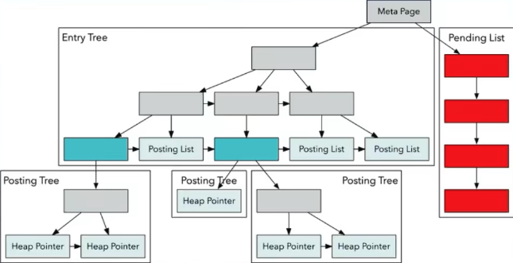

One of the most powerful concepts I've come across in backend systems is the **Inverted Index**.

Here's the problem - if you want users to search millions of documents, scanning each one for matching words is painfully slow...

You'd have to reload, tokenize, and compare every document on every query....

*It just doesn't scale.*

The answer?

Build an inverted index, a data structure that maps words to document IDs.

Here's how it works:

During indexing, for each word, you store the list of documents it appears in.

So if somebody searches "lazy fox", "lazy" maps to one set of document ID's, "fox" maps to
another set of document ID's, and the intersection gives you a single document ID.

No full document scan, just two index lookups and a quick set intersection.

Then you rank the results with TF, IDF or BM25, which boosts rare meaningful terms, and downplays common ones like "the".

Inverted indexes power searching `Elasticsearch`, `Postgres`, `Gin`, and even underpin Gmail's search before the fancy ranking kicks in.

So if you're adding full text search to your app, start with an inverted index - it's simple, powerful and battle tested.

[Follow](https://www.linkedin.com/in/john-pratt787) for more dev tips.
