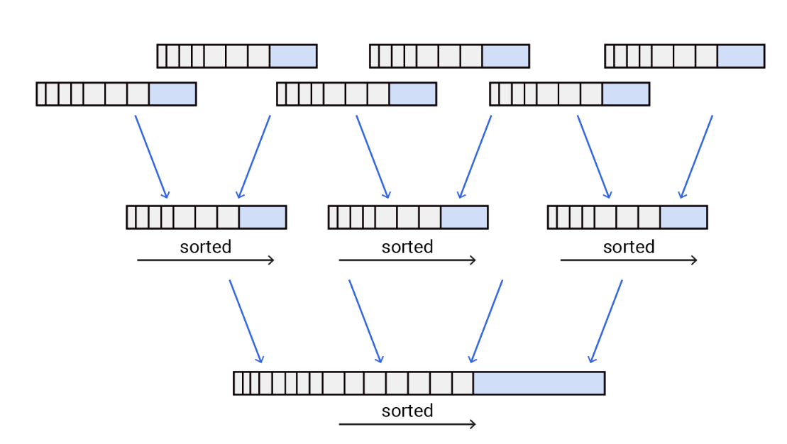

One of the most clever data structures in back end systems is the Log-structured merge-tree, or **LSM tree.**

Here's the problem: If your app's doing tons of writes, traditional B-trees can't keep up. They write all over the disk, causing random IO, and that's slow.

LSM trees fix this by flipping the script, and here's how: writes go to an in memory structure called a "memtable" (often a sorted tree). It's fast, cheap, and it batches them.

Once it fills up, it flushes to disk as a sorted file called a Sorted Strings Table (SSTable for short). Multiple levels of these files get merged in the background. That's the merge in LSM. So instead of random writes, it's sequential appends, which are much faster on SSDs.

As for reads, they search across memory and disk levels, often with a Bloom Filter to skip irrelevant files. So if you're dealing with seriously write-heavy workloads (think logs, metrics, events), don't just scale hardware - use a data store that's built for that scale like Cassandra, RocksDB, or LevelDB.

[Follow](https://www.linkedin.com/in/john-pratt787) for more dev tips!

