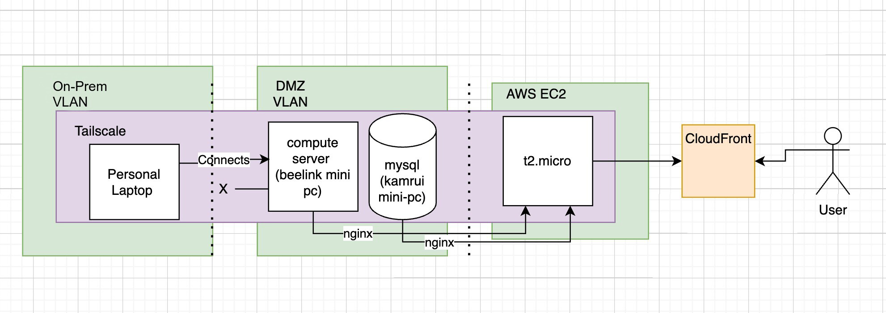

**Author:** John Pratt, AWS Solutions Architect Professional

---

### Client Background

When you're a nimble digital media startup, you're fighting two fronts at once - rapid content delivery and smart cost containment. You want to compete with big players in responsiveness and uptime, but you're also running lean. That's where this hybrid, edge-enabled, Tailscale-powered architecture comes in. It's the stack my team put in place for a digital media company that needed to ingest, process, and serve content at speed while their creators upload content to customers.

The key goals?

* Low latency media serving
* Easy-to-manage compute for rendering and ingestion
* Secure remote access for devs working from any office
* All while staying well within startup budget constraints

---

### Challenge

We faced a set of very real problems:

1. **Ops Practicality**: Going all-in on cloud sounded easy - until practical considerations like Editor workflows are taken into account
2. **Remote developer access**: The team needed secure access from any office, but a full VPN setup was overkill and brittle.
3. **Compute sprawl**: Encoding, rendering, and lightweight API hosting had to happen somewhere, but AWS alone was too pricey to handle the massive scale of video editing their creators need.
4. **Content delivery performance**: Customers wanted blazing-fast access to digital media - latency had to be minimal.

We had to bridge the on-prem and cloud worlds - intelligently.

---

### Solution

Here's what the final architecture looks like:

#### 💻 **On-Prem VLAN**

* **Tailscale**: Our zero-config, mesh VPN glue. Lets personal laptops talk securely to on-prem compute nodes.
* **Compute Server (Beelink Mini-PC)**: Handles intensive media encoding and AI inference tasks. Think FFMPEG, custom ML models, etc.

#### 📦 **DMZ VLAN**

* **MySQL Server (Kamrui Mini-PC)**: Lightweight, persistent storage layer.
* **Nginx**: Reverse proxies traffic into the DMZ, balancing access to database and compute functions.

#### ☁️ **AWS EC2 (t2.micro)**

* Minimalist frontend API + presentation layer.
* All exposed endpoints are static/dynamic pages piped through CloudFront.

#### 🚀 **CloudFront**

* Blazing fast delivery of content and APIs.
* Handles TLS termination, caching, and acts as the secure front gate to the architecture.

#### 👨‍💻 **End User**

* Doesn't know or care where the compute lives - just gets instant access to media content.

This hybrid design merges on-prem power with cloud elasticity. It's affordable, performant, and location agnostic.

---

### Results

#### ✅ Topic: *Modernizing Infrastructure for Content-Driven Startups*

#### ⚠️ Importance & Risks:

* **Cost Drift**: Pure cloud infra often results in surprise AWS bills.
* **Developer Bottlenecks**: Without fast, secure access to compute and storage, productivity drops.
* **Poor UX**: High latency or media load failures kill user retention.

#### 💡 Our Advice (from the trenches):

* **Start at the Edge**: Use local hardware (mini-PCs are criminally underrated) for predictable compute costs.
* **Mesh is Might**: Tools like Tailscale make complex networking setups obsolete.
* **Split and Optimize**: Push user-facing endpoints to CloudFront, and keep backend logic close to devs or data.
* **Invest in Simplicity**: This design requires very little babysitting. Great for small teams without a full-time DevOps resource.

---

### Conclusion

This architecture isn't just clever - it's effective. The startup improved their content delivery times by ~20%, slashed potential AWS bills by $2.5k/mo (which will only increase as they scale up more), and gave their dev team full-stack access from anywhere, securely. It's a real-world example of how (with the right business context) hybrid systems can be your best friend - not your legacy debt.

If you're a media startup trying to scale smart, not just fast - this blueprint might just be your unfair advantage.

**Interested in learning more? [Get in touch](https://john-pratt.com/#contact) to discuss your Cloud, DevOps, & Infrastructure needs.**